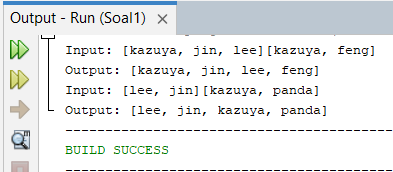
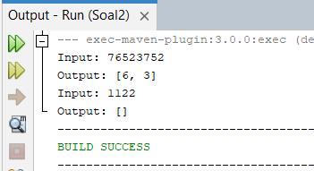
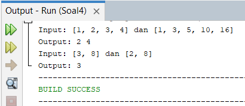
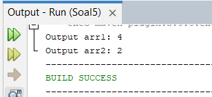

# (10) Projek Praktikum [10_Iterable and Map Data Structure]
## Iftitah Hidayati (QE - A)
Berikut merupakan hasil project dari pengerjaan tugas praktikum.
___

# **SOAL NO 1**
### **KODE PROGRAM**

**Penjelasan**

Pada kode program tersebut terdapat 4 objek array list dengan parameter nilai list nama. Kemudian menambahkan item dari list ke set dengan set dan set1. Serta mengubah set ke ArrayList dengan kombinasi list. kemudian ditampilkan baik input di list dan output di combineList

### **OUTPUT / HASIL**

Berikut merupakan hasil dari kode program tersebut dimana akan menampilkan list array yang telah diinputkan dan menampilkan output dari list yang telah dicombine pada set.
___
# **SOAL NO 2**
### **KODE PROGRAM**

**Penjelasan**

Pada kode program tersebut terdapat inputan String yang kemudian dimasukkan ke list dengan menggunakan perulangan maka akan dilakukan pencocokan inputan yang telah masuk kedalam list dengan yang akan dimasukkan pada arraylist, jika terdapat yang angka yang berbeda maka disimpan di list dengan nama output.

### **OUTPUT / HASIL**

Berikut merupakan hasil dari kode program tersebut dimana akan menampilkan angka yang tidak pernah dipanggil ulang.
___

# **SOAL NO 3**
### **KODE PROGRAM**

**Penjelasan**

Pada kode program tersebut terdapat array kemudian target 6 , dimana kode ini dilakukan untuk melakukan pencarian pasangan bilangan yang sesuai.

### **OUTPUT / HASIL**

Berikut merupakan hasil dari kode program tersebut dimana akan menampilkan hasil bilangan yang sesuai dengan pencarian pasangan bilangan yang sesuai.
___
# **SOAL NO 4**
### **KODE PROGRAM**

**Penjelasan**

Pada kode program tersebut dilakukan untuk mencari nilai yang ada dan sama di kedua arraylist tersebut atau disebut juga dengan irisan.

### **OUTPUT / HASIL**

Berikut merupakan hasil dari kode program tersebut dimana akan menampilkan nilai yang sama di kedua arrayList tersebut atau irisan.
___

# **SOAL NO 5**
### **KODE PROGRAM**

**Penjelasan**

Pada kode program tersebut dilakukan untuk meremove duplicate nilai pada array dengan melakukan pengecekan menggunakan perulangan kemudian dikembalikan nilai yang telah dilakukan pengecekan duplikat ke method main.

### **OUTPUT / HASIL**

Berikut merupakan hasil dari kode program tersebut dimana akan menampilkan banyaknya nilai yang telah diremove karena duplicate atau sama.
.
___
# **SOAL NO 6**
### **KODE PROGRAM**

**Penjelasan**

Pada kode program tersebut terdapat 2 method dimana pada method findmaxSubArray untuk mencari maksimal array kemudian dilakukan sum atau total dari max array tersebut.

### **OUTPUT / HASIL**

Berikut merupakan hasil dari kode program tersebut dimana akan menampilkan nilai atau hasil pencarian dan perhitungan max array.
___