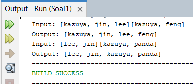
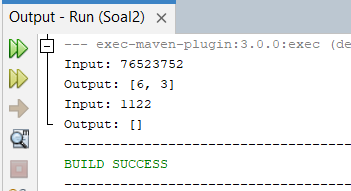
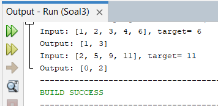
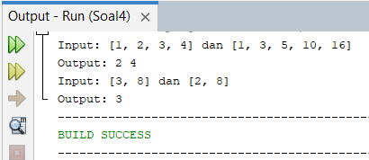
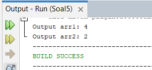
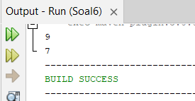

# (10) Screenshot [10_Iterable and Map Data Structure]
## Iftitah Hidayati (QE - A)
Pada folder ini berisi screenshots dari pengerjaan tugas praktikum.

___
### Untuk Source Code .java dan *outputnya* (Projek) terdapat pada folder praktikum, **dibawah ini merupakan penampilan output atau hasil dari projek**

___
## **PENJELASAN OUTPUT ADA DI README.MD PADA FOLDER PRAKTIKUM**
___
### **Output Soal No 1**

___
### **Output Soal No 2**

___
### **Output Soal No 3**

___
### **Output Soal No 4**

___
### **Output Soal No 5**

___
### **Output Soal No 6**

