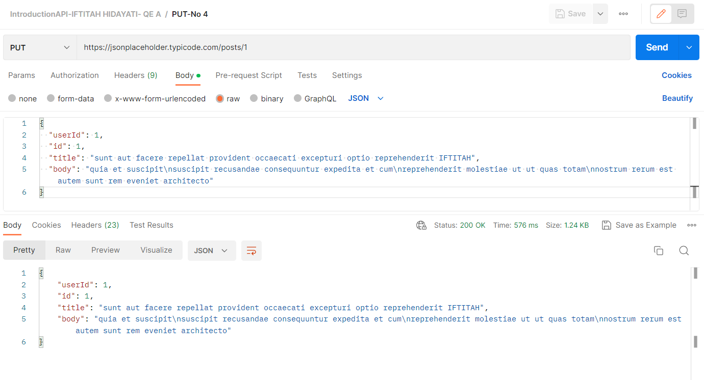

# (11) Projek Praktikum [11_Pengenalan RESTful API]
## Iftitah Hidayati (QE - A)
Berikut merupakan hasil project dari pengerjaan tugas praktikum.
___

## **KODE PROGRAM dan HASIL (OUTPUT)**
___
### **SOAL NO 1**

Diatas merupakan Pemanggilan atau menampilkan seluruh users dengan detailnya dengan status "200 Ok" yang artinya sukses atau berhasil.

___
### **SOAL NO 2**

Diatas merupakan Pembuatan atau create data baru dengan status "201 Created" yang artinya berhasil ditambahkan.

___
### **SOAL NO 3**

Diatas merupakan Pemanggilan atau menampilkan detail user dengan id tertentu yang dipanggil dengan status "200 Ok" yang artinya sukses atau berhasil.

___
### **SOAL NO 4**

Diatas merupakan pengubahan atau edit atau update data dengan status "200 Ok" yang artinya sukses atau berhasil.

___
### **SOAL NO 5**

Diatas merupakan penghapusan data berdasarkan id dengan "200 Ok" yang artinya sukses atau berhasil.

___